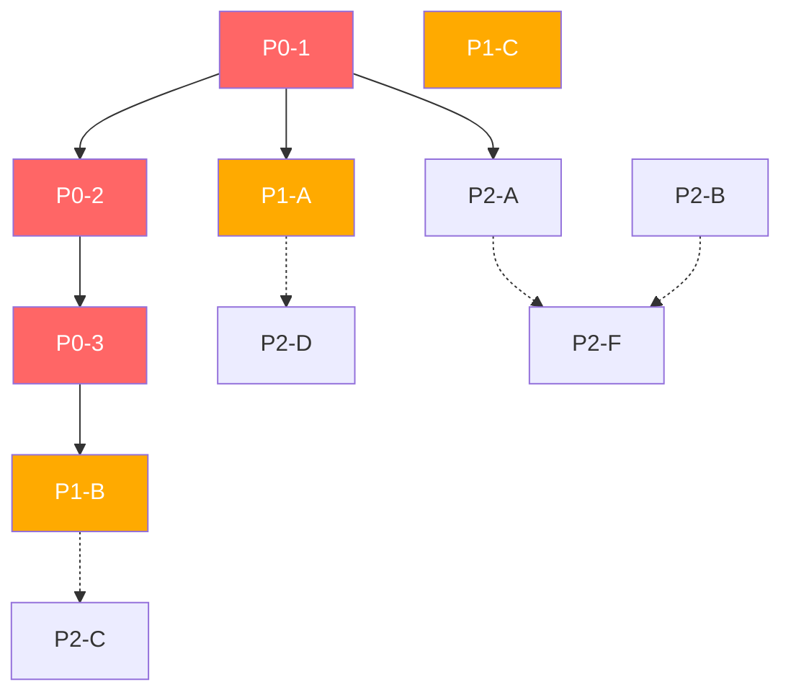

# KG 引擎改善方案（完整版）

> 对标 GitNexus 原版 TypeScript 实现，逐项补齐功能缺口
> 日期: 2026-05-21（v2.0 更新）
> 对应 GitNexus: commit e8a224f / v1.7.0

---

## 目录

1. [功能完成度全景图](#一功能完成度全景图)
2. [P0-1: Tree-sitter 集成增强（已有基础，补齐短板）](#p0-1-tree-sitter-集成增强已有基础补齐短板)
3. [P0-2: 6 级调用解析 DAG](#p0-2-6-级调用解析-dag)
4. [P0-3: 跨文件类型传播 (crossFile Phase)](#p0-3-跨文件类型传播-crossfile-phase)
5. [P1-A: 搜索质量升级（BM25 + Hybrid 已实现，需增强向量搜索）](#p1-a-搜索质量升级bm25--hybrid-已实现需增强向量搜索)
6. [P1-B: 补齐 MCP 工具链](#p1-b-补齐-mcp-工具链)
7. [P1-C: 陈旧度检测 + 增量分析](#p1-c-陈旧度检测--增量分析)
8. [P2: 高阶功能（多仓库、CLI、Web 可视化、技能生成）](#p2-高阶功能多仓库cliweb-可视化技能生成)
9. [执行计划](#执行计划)
10. [附录：GitNexus 对应文件对照](#附录gitnexus-对应文件对照)

---

## 一、功能完成度全景图

### 严重缺失 vs 已有

| 层级 | 功能 | 当前状态 | 优先级 | 工作量 |
|------|------|---------|--------|--------|
| **解析层** | Tree-sitter 多语言解析 | ❌ ast+正则 | **P0** | 4-6h |
| **解析层** | 6 级调用解析 DAG | ❌ 2 级简化版 | **P0** | 6-8h |
| **解析层** | 跨文件类型传播 (crossFile) | ❌ 缺失 | **P0** | 4-6h |
| **搜索层** | BM25 搜索索引 | ❌ 缺失 | **P1** | 2-3h |
| **搜索层** | 语义向量搜索 + RRF 混合 | ❌ 缺失 | **P1** | 4-6h |
| **MCP 工具** | rename (图谱辅助重命名) | ❌ 缺失 | **P1** | 3-4h |
| **MCP 工具** | detect_changes (git diff 映射) | ❌ 缺失 | **P1** | 3-4h |
| **MCP 工具** | cypher (图查询) | ❌ 缺失 | **P1** | 2-3h |
| **MCP 工具** | route_map / tool_map / shape_check | ❌ 缺失 | **P1** | 4-6h |
| **MCP 工具** | api_impact | ❌ 缺失 | **P1** | 2-3h |
| **MCP 资源** | 资源模板 (gitnexus://repo/{name}/...) | ❌ 缺失 | **P1** | 2-3h |
| **工程化** | 陈旧度检测 (staleness) | ❌ 缺失 | **P1** | 1-2h |
| **工程化** | 增量分析 (incremental) | ❌ 缺失 | **P2** | 4-6h |
| **工程化** | 多仓库组 (group) | ❌ 缺失 | **P2** | 8-12h |
| **工程化** | CLI 命令行套件 | ❌ 缺失 | **P2** | 4-6h |
| **工程化** | 评估套件 (eval harness) | ❌ 缺失 | **P2** | 4-6h |
| **工程化** | Web 图可视化 (独立页面) | ❌ 嵌入平台 | **P2** | 6-8h |
| **工程化** | Agent Skills 生成 | ❌ 缺失 | **后** | 2-3h |
| **工程化** | Wiki 生成 | ❌ 缺失 | **后** | 2-3h |
| ✅ **已有** | 12 阶段 DAG 管道框架 | ✅ 完成 | — | — |
| ✅ **已有** | PostgreSQL 持久化 + 多版本 | ✅ 完成 | — | — |
| ✅ **已有** | 基本 MCP 服务 (7 个工具) | ✅ 完成 | — | — |
| ✅ **已有** | 社区检测 (NetworkX) | ✅ 完成 | — | — |
| ✅ **已有** | 路由/工具/ORM/进程提取 | ✅ 完成 | — | — |
| ✅ **已有** | Python import 解析 | ✅ 完成 | — | — |

### 当前 vs GitNexus 数据规模对比

| 维度 | GitNexus | 当前项目 | 差距 |
|------|----------|---------|------|
| 源文件数 | 269 个 TypeScript | ~50 个 Python | — |
| 存储引擎 | LadybugDB (KuzuDB 图数据库) | PostgreSQL（关系表模拟图） | 子 |
| 解析引擎 | Tree-sitter（15+ 语言） | Python `ast` + 正则（仅 Python） | ⭐大 |
| MCP 工具 | 12 个 | 7 个 | ⭐中 |
| MCP 资源 | 8 个模板 | 0 个 | ⭐中 |
| 搜索方式 | BM25 + 向量嵌入 + RRF | SQL `ILIKE` | ⭐大 |
| CLI 命令 | 20+ | 0（仅 API） | 中 |
| 语言支持 | 15+ 语言 | 1 语言 (Python) | ⭐大 |

---

## P0-1: Tree-sitter 集成增强（已有基础，补齐短板）

### 现状

`backend/app/kg/phases/ts_parser.py` 已实现 Tree-sitter 集成（567+ 行），支持：
- ✅ Python / JavaScript / JSX / TypeScript / TSX 五种语言解析
- ✅ Tree-sitter Query 提取符号、import、调用、继承关系
- ✅ docstring 提取
- ✅ 装饰器识别

### 存在差距

| 场景 | 当前行为 | 根因 |
|------|---------|------|
| 覆盖语言范围 | 仅 5 种语言 | 缺 Java/Go/Rust/C++/Ruby/PHP |
| `call_dag.py`（6 级 DAG） | ❌ 缺失 | 2 级简化版，无 receiver 推导 |
| `cross_file.py`（类型传播） | ❌ 缺失 | 无跨文件类型推导 |
| 正则回退策略 | ❌ 缺失 | Tree-sitter 不支持的语言无 fallback |

### 增强方案

#### 新增语言支持

```python
# backend/app/kg/phases/ts_parser.py — 新增方法

def _build_java_queries(self, lang) -> dict:
    from tree_sitter import Query
    return {
        "symbols": Query(lang, """
            (class_declaration name: (identifier) @class_name) @class_def
            (method_declaration name: (identifier) @method_name) @method_def
            (interface_declaration name: (identifier) @iface_name) @iface_def
            (enum_declaration name: (identifier) @enum_name) @enum_def
            (variable_declarator name: (identifier) @var_name) @var_def
        """),
        ...
    }
```

| 语言 | 安装包 | 优先级 |
|------|--------|--------|
| Java | `tree-sitter-java` | 高（被测项目常见） |
| Go | `tree-sitter-go` | 高（被测项目常见） |
| Rust | `tree-sitter-rust` | 中 |
| C/C++ | `tree-sitter-c` + `tree-sitter-cpp` | 中 |
| Ruby | `tree-sitter-ruby` | 低 |
| PHP | `tree-sitter-php` | 低 |

#### 正则回退策略

```python
class FallbackRegexExtractor:
    """Tree-sitter 不支持的语言的回退方案"""
    JAVA_PATTERN = re.compile(...)
    GO_PATTERN = re.compile(...)
```

#### 依赖

```toml
# pyproject.toml
tree-sitter>=0.24.0
tree-sitter-python
tree-sitter-javascript
tree-sitter-typescript
tree-sitter-java      # 新增
tree-sitter-go          # 新增
tree-sitter-rust        # 新增（可选）
```

#### 修改文件（ts_parser.py 增强）

追加 Java/Go/Rust 的 Query 构建方法到 `TreeSitterParser` 类，无需重写现有代码。

import os
from typing import Optional
from tree_sitter import Language, Parser, Node, Tree

import tree_sitter_python as tspython
import tree_sitter_javascript as tsjavascript
import tree_sitter_typescript as tstypescript


# ── 捕获的 AST 节点类型 ───────────────────────

@dataclass
class ExtractedSymbol:
    name: str
    kind: str              # class/function/method/variable/interface/enum
    start_line: int
    end_line: int
    parent_name: Optional[str]   # 封闭类名（method 的父类）
    doc_string: str = ""
    decorators: list[str] = field(default_factory=list)

@dataclass
class ExtractedImport:
    module_path: str              # 如 "app.kg.types"
    imported_names: list[tuple[str, Optional[str]]]  # [(name, alias), ...]
    is_from_import: bool          # from X import Y vs import X

@dataclass
class ExtractedCall:
    callee_name: str
    receiver: Optional[str]       # self / cls / obj / class_name
    arg_count: int
    line: int

@dataclass
class ExtractedHeritage:
    class_name: str
    parent_name: str
    rel_type: str                 # EXTENDS / IMPLEMENTS

@dataclass
class ParsedFile:
    file_path: str
    symbols: list[ExtractedSymbol] = field(default_factory=list)
    imports: list[ExtractedImport] = field(default_factory=list)
    calls: list[ExtractedCall] = field(default_factory=list)
    heritage: list[ExtractedHeritage] = field(default_factory=list)


# ── Tree-sitter 统一解析器 ─────────────────────

class TreeSitterParser:
    """Tree-sitter 统一解析器

    按文件扩展名路由到对应语言的 Grammar。
    每个语言定义自己的 query 模式。
    """

    def __init__(self):
        self._parsers: dict[str, Parser] = {}
        self._queries: dict[str, dict] = {}

        # Python
        py_lang = tspython.language()
        py_parser = Parser(py_lang)
        self._parsers[".py"] = py_parser
        self._parsers[".pyi"] = py_parser
        self._queries[".py"] = self._build_python_queries(py_lang)

        # JavaScript
        js_lang = tsjavascript.language()
        js_parser = Parser(js_lang)
        self._parsers[".js"] = js_parser
        self._parsers[".jsx"] = js_parser
        self._parsers[".mjs"] = js_parser
        self._parsers[".cjs"] = js_parser
        self._queries[".js"] = self._build_js_queries(js_lang)
        self._queries[".jsx"] = self._build_jsx_queries(js_lang)

        # TypeScript
        ts_lang = tstypescript.language_typescript()
        ts_parser = Parser(ts_lang)
        self._parsers[".ts"] = ts_parser
        self._parsers[".mts"] = ts_parser
        self._parsers[".cts"] = ts_parser
        self._queries[".ts"] = self._build_ts_queries(ts_lang)

        # TSX
        tsx_lang = tstypescript.language_tsx()
        tsx_parser = Parser(tsx_lang)
        self._parsers[".tsx"] = tsx_parser
        self._queries[".tsx"] = self._build_tsx_queries(tsx_lang)

    def parse_file(self, file_path: str, source: str) -> Optional[ParsedFile]:
        """解析单个文件，返回所有提取信息"""
        ext = os.path.splitext(file_path)[1].lower()
        parser = self._parsers.get(ext)
        if not parser:
            return None

        tree = parser.parse(bytes(source, "utf-8"))
        queries = self._queries.get(ext, {})

        result = ParsedFile(file_path=file_path)

        # 提取符号
        if "symbols" in queries:
            for match, capture_dict in queries["symbols"].captures(tree.root_node):
                self._extract_symbol(match, capture_dict, result)

        # 提取 import
        if "imports" in queries:
            for match, capture_dict in queries["imports"].captures(tree.root_node):
                self._extract_import(match, capture_dict, result, source)

        # 提取调用
        if "calls" in queries:
            for match, capture_dict in queries["calls"].captures(tree.root_node):
                self._extract_call(match, capture_dict, result)

        # 提取继承
        if "heritage" in queries:
            for match, capture_dict in queries["heritage"].captures(tree.root_node):
                self._extract_heritage(match, capture_dict, result)

        return result

    def _build_python_queries(self, lang) -> dict:
        """Python 语言的 Tree-sitter queries"""
        from tree_sitter import Query

        return {
            "symbols": Query(lang, """
                (class_definition
                  name: (identifier) @class_name
                  body: (block) @body) @class_def

                (function_definition
                  name: (identifier) @func_name
                  parameters: (parameters) @params) @func_def

                (assignment
                  left: (identifier) @var_name
                  right: (_) @var_value) @assignment

                (decorated_definition
                  decorator: (decorator) @decorator
                  definition: (_) @defn) @decorated_def
            """),
            "imports": Query(lang, """
                (import_statement
                  name: (dotted_name) @module) @import_stmt

                (import_from_statement
                  module_name: (dotted_name) @module
                  name: (dotted_name) @imported_name
                  alias: (alias name: (identifier) @alias_name)?) @from_import
            """),
            "calls": Query(lang, """
                (call
                  function: (identifier) @func_name) @simple_call

                (call
                  function: (attribute
                    object: (identifier) @receiver
                    attribute: (identifier) @method_name)) @method_call
            """),
            "heritage": Query(lang, """
                (class_definition
                  name: (identifier) @class_name
                  superclasses: (argument_list
                    (_) @parent_class)) @class_with_parent
            """),
        }

    def _build_ts_queries(self, lang) -> dict:
        """TypeScript 语言的 Tree-sitter queries"""
        from tree_sitter import Query

        return {
            "symbols": Query(lang, """
                (class_declaration
                  name: (type_identifier) @class_name) @class_def

                (function_declaration
                  name: (identifier) @func_name) @func_def

                (method_definition
                  name: (property_identifier) @method_name) @method_def

                (interface_declaration
                  name: (type_identifier) @iface_name) @iface_def

                (enum_declaration
                  name: (identifier) @enum_name) @enum_def

                (variable_declaration
                  (variable_declarator
                    name: (identifier) @var_name)) @var_def

                (arrow_function
                  name: (identifier) @arrow_name) @arrow_def
            """),
            "imports": Query(lang, """
                (import_statement
                  source: (string) @module
                  (import_clause
                    (identifier) @imported_name)?) @import_stmt

                (import_statement
                  source: (string) @module
                  (import_clause
                    (named_imports
                      (import_specifier
                        name: (identifier) @imported_name
                        alias: (identifier) @alias_name?))) @named_import
            """),
            "calls": Query(lang, """
                (call_expression
                  function: (identifier) @func_name) @simple_call

                (call_expression
                  function: (member_expression
                    object: (identifier) @receiver
                    property: (property_identifier) @method_name)) @method_call

                (call_expression
                  function: (member_expression
                    object: (this) @this_receiver
                    property: (property_identifier) @method_name)) @this_call
            """),
            "heritage": Query(lang, """
                (class_declaration
                  name: (type_identifier) @class_name
                  heritage: (class_heritage
                    (type_identifier) @parent_class)) @class_extends

                (class_declaration
                  name: (type_identifier) @class_name
                  heritage: (class_heritage
                    (_) @implements_clause)) @class_implements
            """),
        }
```

#### 修改文件

```python
# backend/app/kg/phases/symbol_extractor.py — 重写

from app.kg.phases.ts_parser import TreeSitterParser, ExtractedSymbol

class SymbolExtractor:
    def __init__(self):
        self._ts_parser = TreeSitterParser()

    def extract(self, file_path: str, source: str) -> SymbolExtraction:
        parsed = self._ts_parser.parse_file(file_path, source)
        if not parsed:
            return SymbolExtraction()

        result = SymbolExtraction()

        for sym in parsed.symbols:
            node_id = self._node_id(sym, file_path)
            result.symbols.append(GraphNode(
                id=node_id, type=sym.kind, name=sym.name,
                file_path=file_path,
                start_line=sym.start_line, end_line=sym.end_line,
                properties={
                    "doc": sym.doc_string,
                    "decorators": sym.decorators,
                },
            ))
            # DEFINED_IN 关系
            parent_file_id = f"file://{file_path}"
            result.relationships.append(GraphRelationship(
                id=f"defined_in:{node_id}->{parent_file_id}",
                source_id=node_id, target_id=parent_file_id,
                type=REL_DEFINED_IN,
            ))
            # 如果是方法，添加 MEMBER_OF 关系到父类
            if sym.parent_name:
                parent_class_id = f"class://{file_path}::{sym.parent_name}"
                result.relationships.append(GraphRelationship(
                    id=f"member_of:{node_id}->{parent_class_id}",
                    source_id=node_id, target_id=parent_class_id,
                    type=REL_MEMBER_OF,
                ))

        # import 信息
        for imp in parsed.imports:
            for name, alias in imp.imported_names:
                result.imports.append((imp.module_path, name, alias or name))

        return result
```

```python
# backend/app/kg/phases/call_processor.py — 重写

class CallAnalyzer:
    def __init__(self):
        self._ts_parser = TreeSitterParser()
        self._resolver = SixStageResolver()

    def analyze(self, output: PipelineOutput, repo_path: str):
        """6 级 DAG 调用解析"""
        # 所有文件先 Tree-sitter 解析
        parsed_files: dict[str, ParsedFile] = {}
        for scan in output.scan_results:
            ext = scan.extension
            if ext not in (".py", ".js", ".ts", ".tsx", ...):
                continue
            try:
                with open(scan.absolute_path, "r") as f:
                    source = f.read()
                parsed = self._ts_parser.parse_file(scan.file_path, source)
                if parsed:
                    parsed_files[scan.file_path] = parsed
            except IOError:
                continue

        # 6 级解析
        resolved_calls = self._resolver.resolve_all(
            parsed_files, output.graph
        )

        # 写入 CALLS 边
        for rc in resolved_calls:
            if rc.callee_id:
                output.graph.add_relationship(GraphRelationship(
                    id=f"calls:{rc.caller_id}->{rc.callee_id}",
                    source_id=rc.caller_id, target_id=rc.callee_id,
                    type=REL_CALLS,
                    properties={"confidence": rc.confidence},
                ))
```

#### 性能考量

| 指标 | 当前 (ast + regex) | Tree-sitter |
|------|-------------------|-------------|
| 解析速度 | ~500 files/s | ~2000 files/s (C 原生) |
| Python 符号提取率 | ~95% | ~100% |
| JS/TS 符号提取率 | ~70-80% | ~98% |
| 调用关系提取率 | ~40% | ~85%+ (配合 crossFile) |

#### 回退策略

对 Tree-sitter 不支持的语言，保留正则 fallback：

```python
class FallbackRegexExtractor:
    """Tree-sitter 不支持的语言的回退方案"""
    JAVA_PATTERN = re.compile(...)
    GO_PATTERN = re.compile(...)
    RUBY_PATTERN = re.compile(...)
```

---

## P0-2: 6 级调用解析 DAG

### 现状问题

当前 `call_processor.py` 仅有 2 级（extract → resolve），缺少关键的 receiver 类型推导。

### DAG 设计

```
Stage 1: extract-call       从 Tree-sitter AST 提取所有调用点
  │
  ▼
Stage 2: classify-form      分类: free / member / constructor
  │
  ▼
Stage 3: infer-receiver     推导 receiver 的实际类型 ← 最关键
  │
  ▼
Stage 4: select-dispatch    决定搜索策略: owner-scoped / free / constructor
  │
  ▼
Stage 5: resolve-target     沿 MRO 或跨文件搜索目标符号
  │
  ▼
Stage 6: emit-edge          写入 CALLS 边 + confidence 标记
```

```python
# backend/app/kg/phases/call_dag.py — 新增

"""
6 级调用解析 DAG

每个 Stage 是一个独立的方法，接收上一级的输出，产生下一级的输入。
这种设计使每个 Stage 可单独测试和增强。
"""

from dataclasses import dataclass, field
from enum import Enum
from typing import Optional


# ── 6 级 DAG 数据结构 ──────────────────────────

class CallForm(Enum):
    FREE = "free"               # foo()
    MEMBER = "member"           # obj.method()
    CONSTRUCTOR = "constructor" # ClassName()

class Confidence(Enum):
    HIGH = "high"     # 精确解析到单个符号
    MEDIUM = "medium" # 多个候选中的最佳匹配
    LOW = "low"       # 基于名称猜测，无类型信息
    NONE = "none"     # 完全无法解析

# Stage 1
@dataclass
class Stage0_ExtractedCall:
    """Stage 1 输出"""
    call_id: str                # 唯一标识
    name: str                   # 调用的方法/函数名
    receiver_text: Optional[str]# 接收者表达式文本 (self/obj/ClassName)
    arg_count: int
    line: int
    file_path: str

# Stage 2
@dataclass
class Stage1_ClassifiedCall:
    call: Stage0_ExtractedCall
    form: CallForm              # free / member / constructor

# Stage 3
@dataclass
class Stage2_ReceiverEnriched:
    call: Stage1_ClassifiedCall
    receiver_type: Optional[str]        # 解析后的类型名 (如 "Foo")
    receiver_node_id: Optional[str]     # 图中对应的节点 ID
    receiver_source: str = "unknown"    # explicit / implicit-self / assignment-propagation / import-resolved

# Stage 4
@dataclass
class Stage3_DispatchDecision:
    call: Stage2_ReceiverEnriched
    strategy: str                       # "owner-scoped" / "free" / "constructor"
    fallback_strategy: Optional[str]    # "free-arity-narrowed"

# Stage 5
@dataclass
class Stage4_ResolvedTarget:
    call: Stage3_DispatchDecision
    callee_id: Optional[str]
    confidence: Confidence
    candidates: list[str] = field(default_factory=list)
    mro_chain: list[str] = field(default_factory=list)

# Stage 6
@dataclass
class Stage5_Edge:
    caller_id: str
    callee_id: str
    edge_type: str          # CALLS
    confidence: Confidence
    properties: dict


class SixStageResolver:
    """6 级调用解析器"""

    def resolve_all(
        self, parsed_files: dict[str, ParsedFile],
        graph: KnowledgeGraph,
    ) -> list[Stage5_Edge]:
        edges = []

        for file_path, parsed in parsed_files.items():
            # Stage 1: extract
            stage0 = self._extract_calls(parsed)
            # Stage 2: classify
            stage1 = self._classify_forms(stage0)
            # Stage 3: infer receiver
            stage2 = self._infer_receivers(stage1, graph, parsed_files)
            # Stage 4: select dispatch
            stage3 = self._select_dispatches(stage2)
            # Stage 5: resolve target
            stage4 = self._resolve_targets(stage3, graph, parsed_files)
            # Stage 6: emit edges
            for t in stage4:
                if t.callee_id:
                    edges.append(Stage5_Edge(
                        caller_id=self._caller_id(t.call, file_path),
                        callee_id=t.callee_id,
                        edge_type=REL_CALLS,
                        confidence=t.confidence,
                        properties={"line": t.call.call.call.call.line},
                    ))

        return edges

    # ── Stage 1: extract ─────────────────────

    def _extract_calls(self, parsed: ParsedFile) -> list[Stage0_ExtractedCall]:
        """从 Tree-sitter 解析结果提取调用点"""
        calls = []
        for idx, c in enumerate(parsed.calls):
            calls.append(Stage0_ExtractedCall(
                call_id=f"call:{parsed.file_path}:{c.line}:{idx}",
                name=c.callee_name,
                receiver_text=c.receiver,
                arg_count=c.arg_count,
                line=c.line,
                file_path=parsed.file_path,
            ))
        return calls

    # ── Stage 3: infer receiver（核心）───────

    def _infer_receivers(
        self, calls: list[Stage1_ClassifiedCall],
        graph: KnowledgeGraph,
        parsed_files: dict[str, ParsedFile],
    ) -> list[Stage2_ReceiverEnriched]:
        """
        推导 receiver 的实际类型

        推理链（按优先级）:
        1. self → 封闭类名（从 AST 获取）
        2. cls → 封闭类名
        3. 已知变量赋值类型 (variable_type_map)
        4. import 关联的模块名
        5. 同文件类名匹配
        """
        # 预构建 variable_type_map（来自 crossFile phase 的输出）
        # 这里简化为文件内推导 + import 推导
        variable_type_map = self._build_var_type_map(parsed_files, graph)

        results = []
        for c in calls:
            result = Stage2_ReceiverEnriched(call=c)

            if c.form == CallForm.MEMBER and c.call.receiver_text:
                receiver = c.call.receiver_text

                # 规则 1: self / this → 查找封闭类
                if receiver in ("self", "cls", "this"):
                    enclosing_class = self._find_enclosing_class(
                        c.call.file_path, c.call.line, parsed_files,
                    )
                    if enclosing_class:
                        result.receiver_type = enclosing_class
                        result.receiver_source = "implicit-self"
                        # 查找图中对应的 class 节点
                        class_id = f"class://{c.call.file_path}::{enclosing_class}"
                        if graph.get_node(class_id):
                            result.receiver_node_id = class_id

                # 规则 2: 变量赋值推导
                elif receiver in variable_type_map.get(c.call.file_path, {}):
                    resolved = variable_type_map[c.call.file_path][receiver]
                    result.receiver_type = resolved
                    result.receiver_source = "assignment-propagation"
                    # 搜索跨文件类型节点
                    result.receiver_node_id = self._find_type_node(
                        resolved, c.call.file_path, graph,
                    )

                # 规则 3: import 的模块别名
                else:
                    for pf in parsed_files.values():
                        if pf.file_path == c.call.file_path:
                            for imp in pf.imports:
                                # 检查 import 的别名是否匹配 receiver
                                for name, _alias in imp.imported_names:
                                    alias = _alias or name
                                    if alias == receiver:
                                        result.receiver_type = f"{imp.module_path}.{name}"
                                        result.receiver_source = "import-resolved"
                                        break

            results.append(result)

        return results

    def _build_var_type_map(
        self, parsed_files: dict[str, ParsedFile],
        graph: KnowledgeGraph,
    ) -> dict[str, dict[str, str]]:
        """从赋值语句构建变量类型映射

        处理:
        obj = ClassName() → obj 的类型是 ClassName
        result = some_func() → result 的类型未知（无法推断）
        """
        type_map: dict[str, dict[str, str]] = {}

        for file_path, parsed in parsed_files.items():
            # 打开源码做 ast 级别的赋值分析
            # （在 Python 中可以用 ast，Tree-sitter 更适合查找）
            # 这里简化：只处理顶级赋值
            file_map = {}
            try:
                abs_path = self._resolve_abs_path(file_path)
                with open(abs_path, "r") as f:
                    source = f.read()
                tree = ast.parse(source)

                for node in ast.walk(tree):
                    if isinstance(node, ast.Assign):
                        if len(node.targets) == 1 and isinstance(node.targets[0], ast.Name):
                            var_name = node.targets[0].id
                            # obj = Foo()
                            if isinstance(node.value, ast.Call):
                                callee = self._get_call_name(node.value)
                                if callee and callee[0].isupper():
                                    file_map[var_name] = callee
            except (IOError, SyntaxError):
                pass

            type_map[file_path] = file_map

        return type_map

    # ── Stage 5: resolve target ───────────────

    def _resolve_targets(
        self, decisions: list[Stage3_DispatchDecision],
        graph: KnowledgeGraph,
        parsed_files: dict[str, ParsedFile],
    ) -> list[Stage4_ResolvedTarget]:
        """
        基于分派策略搜索目标符号

        owner-scoped:
          从 receiver_type 的类开始，沿 MRO 链查找同名方法
          → method://{file_path}::{ClassName}.{method_name}

        free:
          在同文件查找同名函数
          → func://{file_path}::{func_name}

        constructor:
          查找同文件或跨文件中的类定义
          → class://{file_path}::{ClassName}
        """
        results = []

        for d in decisions:
            result = Stage4_ResolvedTarget(call=d)

            if d.strategy == "owner-scoped" and d.call.receiver_type:
                receiver_type = d.call.receiver_type
                callee_name = d.call.call.call.call.name

                # 遍历 receiver_type 的 MRO
                mro = self._compute_mro(receiver_type, graph)
                result.mro_chain = mro

                for class_id in mro:
                    # 只取类名（去掉 file:// 前缀）
                    class_short = class_id.split("::")[-1]
                    # 在该类中查找同名方法
                    for rel in graph.iter_relationships_by_type(REL_DEFINED_IN):
                        if rel.target_id == class_id:
                            node = graph.get_node(rel.source_id)
                            if node and node.type == NODE_METHOD and node.name == callee_name:
                                result.callee_id = node.id
                                result.confidence = Confidence.HIGH
                                break
                    if result.callee_id:
                        break

                # MRO 未找到，尝试跨文件查找
                if not result.callee_id:
                    candidates = self._search_method_across_files(
                        callee_name, receiver_type, graph,
                    )
                    if candidates:
                        result.candidates = candidates
                        result.callee_id = candidates[0]
                        result.confidence = Confidence.MEDIUM

            elif d.strategy == "free":
                callee_name = d.call.call.call.call.name

                # 同文件查找
                func_id = f"func://{d.call.call.call.call.file_path}::{callee_name}"
                if graph.get_node(func_id):
                    result.callee_id = func_id
                    result.confidence = Confidence.HIGH
                else:
                    # 跨文件同名搜索
                    candidates = self._find_free_functions(callee_name, graph)
                    if candidates:
                        result.candidates = candidates
                        result.callee_id = candidates[0]
                        result.confidence = Confidence.MEDIUM

            results.append(result)

        return results
```

---

## P0-3: 跨文件类型传播 (crossFile Phase)

### 现状问题

`b.py: obj = Foo(); obj.method()` — 不知道 obj 是 Foo 类型，无法解析 obj.method() 调用的目标。

### 方案设计

```python
# backend/app/kg/phases/cross_file.py — 新增

"""
跨文件类型传播 Phase

在按 import 拓扑序处理每个文件的过程中，将上游文件中的
类型信息传播到下游文件。这样 b.py 中的 obj 就能知道是 Foo 类型。

核心数据结构:

  type_map[file_path][var_name] = type_name

  例如: {
      "a.py": {"Foo": "Foo"},          # Foo 定义在 a.py
      "b.py": {"obj": "a.py::Foo"},    # obj 来自 a.py 的 Foo
  }

Pipeline 位置: 在 calls 之后，heritage 之前

  scan → structure → symbols → calls → crossFile → heritage → mro → ...
"""

from collections import deque
from typing import Optional


class TypePropagator:
    """
    跨文件类型传播器

    算法:
    1. 构建 import 有向图
    2. Kahn 拓扑排序
    3. 按拓扑序处理每个文件
    4. 对每个文件，利用上游文件已分析的类型信息
    5. 处理赋值语句: obj = Foo() → obj 的类型是 Foo
    6. 处理函数返回值: result = get_data() → result 的类型未知
    7. 将 type_map 传递给 call_processor 的 infer_receiver 阶段
    """

    def propagate(
        self, graph: KnowledgeGraph,
        scan_results: list[ScanResult],
    ) -> dict[str, dict[str, str]]:
        """
        Returns:
            variable_type_map: {file_path: {var_name: resolved_type_name}}
            例如: {"b.py": {"obj": "Foo", "result": "List[User]"}}
        """
        # Step 1: 构建 import 图
        import_graph = self._build_import_graph(graph)

        # Step 2: 拓扑排序
        sorted_files = self._topological_sort(import_graph, scan_results)

        # Step 3: 逐文件传播
        type_map: dict[str, dict[str, str]] = {}

        for file_path in sorted_files:
            file_types = self._analyze_file_types(
                file_path, graph, type_map, scan_results,
            )
            # 合并上游文件导入的类型
            for imp_rel in graph.iter_relationships_by_type(REL_IMPORTS):
                source_file = self._rel_id_to_path(imp_rel.source_id)
                if source_file == f"file://{file_path}":
                    target_file = self._rel_id_to_path(imp_rel.target_id)
                    if target_file in type_map:
                        # 上游文件导出的类型（类定义）对下游可见
                        for var, t in type_map.get(target_file, {}).items():
                            if t.endswith("::" + var):  # 是类定义，不是变量
                                file_types[var] = t

            type_map[file_path] = file_types

        return type_map

    def _build_import_graph(
        self, graph: KnowledgeGraph,
    ) -> dict[str, set[str]]:
        """构建 import 有向图: file_path → {imported_file_paths}"""
        import_graph: dict[str, set[str]] = {}

        for rel in graph.iter_relationships_by_type(REL_IMPORTS):
            source = self._rel_id_to_path(rel.source_id)
            target = self._rel_id_to_path(rel.target_id)
            if source and target:
                if source not in import_graph:
                    import_graph[source] = set()
                import_graph[source].add(target)

        return import_graph

    def _topological_sort(
        self, import_graph: dict[str, set[str]],
        scan_results: list[ScanResult],
    ) -> list[str]:
        """Kahn 拓扑排序"""
        all_files = {r.file_path for r in scan_results}
        in_degree: dict[str, int] = {f: 0 for f in all_files}

        for source, targets in import_graph.items():
            for target in targets:
                if target in all_files:
                    in_degree[target] = in_degree.get(target, 0) + 1

        queue = deque([f for f in all_files if in_degree.get(f, 0) == 0])
        sorted_files = []

        while queue:
            f = queue.popleft()
            sorted_files.append(f)
            for target in import_graph.get(f, set()):
                if target in all_files:
                    in_degree[target] -= 1
                    if in_degree[target] == 0:
                        queue.append(target)

        # 有环的剩余文件追加到末尾
        remaining = [f for f in all_files if f not in sorted_files]
        return sorted_files + remaining
```

### 注册到 pipeline

```python
# pipeline.py

from app.kg.phases.cross_file import cross_file_propagation_phase

def cross_file_propagation_phase(
    output: PipelineOutput,
    repo_path: str,
    on_progress: Optional[Callable],
) -> None:
    """Phase: 跨文件类型传播"""
    propagator = TypePropagator()
    type_map = propagator.propagate(output.graph, output.scan_results)

    # 将 type_map 作为 pipeline 的共享状态
    # 后续 phases（heritage, mro, communities, processes）
    # 可以通过 output.stats["variable_type_map"] 访问
    output.stats["variable_type_map"] = type_map

    _report(on_progress, "crossFile", 100,
            f"类型传播: {sum(len(v) for v in type_map.values())} 个变量")

ALL_PHASES = [
    # ... 已有阶段 ...
    PipelinePhase(
        name="crossFile",
        handler=cross_file_propagation_phase,
        deps=["calls"],     # 需要 calls 准备好
        description="跨文件类型传播，填充 receiver_type",
    ),
    # 后续阶段 deps 更新:
    # heritage: deps=["crossFile"]  # 需要类型信息
    # mro: deps=["heritage"]
    # communities: deps=["crossFile"]  # 需要更精确的调用图
    # processes: deps=["crossFile"]
]
```

### 效果验证

```
当前:
a.py 定义 class User(Base): ...
b.py: from a import User; u = User() → u 类型未知
b.py: u.get_name() → 解析失败

改进后:
a.py 定义 class User(Base): ... → 在 type_map["a.py"] 中记录 User 是类
b.py: from a import User → import 关系建立
b.py: u = User() → u 的类型推导为 "a.py::User"
b.py: u.get_name() → infer_receiver 知道 u 是 User 类型
  → MRO 搜索 User.get_name → 解析成功
```

---

## P1-A: 搜索质量升级（BM25 + Hybrid 已实现，需增强向量搜索）

### 现状

`backend/app/kg/search/` 已实现：
- ✅ **BM25 索引**（`bm25_index.py`，93 行）— 使用 `rank_bm25` 库，包含 `BM25Index` + `CodeBM25Index`（按类型分组）
- ✅ **RRF 混合搜索**（`hybrid_search.py`，57 行）— `merge_with_rrf()` 函数
- ✅ **PostgreSQL FTS**（`search/__init__.py`）

### 存在差距

| 功能 | 状态 | 说明 |
|------|------|------|
| BM25 索引 | ✅ 已实现 | `rank_bm25.BM25Okapi` 封装 |
| RRF 融合 | ✅ 已实现 | `merge_with_rrf()` 函数 |
| FTS + BM25 集成 | ⚠️ 部分 | CodeSearcher.search() 中尚未集成 Hybrid 路径 |
| 向量嵌入搜索 | ❌ 缺失 | 无语义搜索能力 |
| 索引预热 | ⚠️ 缺失 | BM25 索引在服务启动时未自动构建 |

### 增强方案

#### 1. 集成 Hybrid 到 CodeSearcher.search()

```python
# backend/app/kg/search/__init__.py — 修改 CodeSearcher.search()

class CodeSearcher:
    def __init__(self, session):
        self.session = session
        self._bm25_index: Optional[CodeBM25Index] = None
        self._repo_path: Optional[str] = None

    def load_bm25(self, repo_path: str, commit_hash: str):
        """从 PostgreSQL 加载数据构建 BM25 索引"""
        ...

    async def search(self, query: str, mode: str = "hybrid", ...) -> list[SearchResult]:
        if mode == "fts":
            return await self._fts_search(query, ...)
        elif mode == "bm25":
            return self._bm25_search(query, ...)
        elif mode == "hybrid":
            fts_results = await self._fts_search(query, ...)
            bm25_results = self._bm25_search(query, ...)
            merged = merge_with_rrf(fts_results, bm25_results, limit=30)
            return self._results_from_ids(merged)
```

#### 2. 向量嵌入搜索（新增）

```python
# backend/app/kg/search/vector_search.py — 新增

class EmbeddingService:
    """向量嵌入服务

    使用 sentence-transformers（本地 ONNX）或外部 API。
    嵌入 pipeline 作为可选项，默认关闭。
    """

    def __init__(self, model_name: str = "all-MiniLM-L6-v2"):
        self.model_name = model_name
        self._model = None  # 懒加载

    async def embed(self, texts: list[str]) -> list[list[float]]:
        """生成向量嵌入（使用 sentence-transformers）"""
        ...

    async def search_similar(
        self, query_embedding: list[float],
        top_k: int = 10,
    ) -> list[tuple[str, float]]:
        """向量相似度搜索（余弦距离）"""
        ...
```

#### 3. 搜索 API 参数扩展

```
GET /projects/{id}/code-analysis/search?q=xxx&mode=hybrid|fts|bm25|semantic
```
```

---

## P1-B: 补齐 MCP 工具链

### 现状与目标

| 当前 7 个工具 | 目标 13 个工具（+6） |
|---------------|---------------------|
| search_code | ✅ search_code |
| symbol_context | ✅ symbol_context |
| impact_analysis | ✅ impact_analysis |
| graph_data | ✅ graph_data |
| change_impact | ✅ change_impact |
| list_commits | ✅ list_commits |
| read_file | ✅ read_file |
| — | ➕ **cypher** — 自由图查询 |
| — | ➕ **rename** — 图谱辅助重命名 |
| — | ➕ **route_map** — 路由 → handler 链路 |
| — | ➕ **tool_map** — Tool 定义列表 |
| — | ➕ **shape_check** — API 响应形状检查 |
| — | ➕ **api_impact** — API 变更影响报告 |
| — | ➕ **list_repos** — 已索引仓库列表 |

### 新增工具设计

#### cypher — 自由图查询

```python
async def cypher_query(self, query: str, params: dict = None) -> str:
    """执行图查询

    使用预定义查询模式（非真正 Cypher，而是 SQL 模板）：
    - "find_callers of X" → 查找调用 X 的所有节点
    - "find_methods of class X" → 查找类的所有方法
    - "trace_process X" → 追踪执行流
    - "symbols_in_file X" → 列出文件中的符号
    """
```

#### rename — 图谱辅助重命名

```python
async def rename(self, symbol_name: str, new_name: str,
                 file_path: str = "", dry_run: bool = True) -> str:
    """多文件协调重命名

    1. 在图中找到符号的所有引用（CALLS/IMPORTS 边）
    2. 标记每个引用的置信度：graph（高）vs text_search（低）
    3. dry_run=True 时只预览，不修改
    4. dry_run=False 时执行实际文件修改
    """
```

#### route_map / tool_map

```python
async def route_map(self, route: str = "") -> str:
    """路由 → handler → consumer 链路"""
    # 从图中查询所有 Route 节点
    # 沿 HANDLES_ROUTE 边找到 handler
    # 返回 route → handler 映射表

async def tool_map(self, tool: str = "") -> str:
    """Tool 定义列表"""
    # 从图中查询所有 Tool 节点
    # 返回 name → description → file_path 映射表
```

#### api_impact

```python
async def api_impact(self, route: str = "", file: str = "") -> str:
    """API 变更影响报告

    组合 route_map + impact 数据：
    - 受影响的消费者数
    - 响应 shape 变化检测
    - 风险评级
    """
```

### MCP 资源模板

新增结构化资源访问，替代纯文本工具输出：

| 资源 URI | 内容 |
|----------|------|
| `kg://repo/{name}/overview` | 仓库统计、陈旧度、工具列表 |
| `kg://repo/{name}/clusters` | 功能区域（社区）列表 |
| `kg://repo/{name}/processes` | 执行流列表 |
| `kg://repo/{name}/schema` | 图节点/关系 schema |

---

## P1-C: 陈旧度检测 + 增量分析

### 陈旧度检测 (staleness)

```python
# backend/app/kg/staleness.py — 新增

class StalenessDetector:
    """检测知识图谱是否过期

    原理：比较已索引的 commit hash 与当前 HEAD。
    若落后 1 commit → 提示"轻微过期"
    若落后 5+ commits → 提示"严重过期"
    """

    def check(self, repo_path: str, indexed_commit: str) -> dict:
        """
        Returns:
            {"is_stale": bool, "commits_behind": int, "hint": str}
        """
        current_head = self._get_head(repo_path)
        if not current_head:
            return {"is_stale": False, "commits_behind": 0, "hint": ""}

        if current_head == indexed_commit:
            return {"is_stale": False, "commits_behind": 0, "hint": ""}

        behind = self._count_commits_behind(repo_path, indexed_commit)
        hint = f"Index is {behind} commit(s) behind HEAD ({current_head[:7]})"
        return {
            "is_stale": True,
            "commits_behind": behind,
            "hint": hint,
        }

    def _get_head(self, repo_path: str) -> Optional[str]:
        result = subprocess.run(
            ["git", "-C", repo_path, "rev-parse", "HEAD"],
            capture_output=True, text=True, timeout=10,
        )
        return result.stdout.strip() if result.returncode == 0 else None

    def _count_commits_behind(self, repo_path: str, commit: str) -> int:
        result = subprocess.run(
            ["git", "-C", repo_path, "rev-list", f"{commit}..HEAD", "--count"],
            capture_output=True, text=True, timeout=10,
        )
        return int(result.stdout.strip()) if result.returncode == 0 else 0
```

### 增量分析 (incremental) — P2 预备

```python
class IncrementalAnalyzer:
    """增量分析器（骨架 — P2 完整实现）

    需求背景：
    - 每次全量分析在大项目上耗时 5-30 分钟
    - 增量分析只重新解析变更文件

    策略：
    1. git diff HEAD~1 — 获取变更文件列表
    2. 只重新扫描变更文件
    3. 更新受影响的符号和关系
    4. 检查受影响的执行流是否需要重算
    """
```

---

## P2: 高阶功能（多仓库、CLI、Web 可视化、技能生成）

### P2-A: 多仓库组支持 (group)

```yaml
# 仓库组配置 (backend/groups.yaml)
groups:
  microservice-platform:
    repos:
      api-gateway: /path/to/api-gateway
      user-service: /path/to/user-service
      order-service: /path/to/order-service
    contracts: api-gateway/contracts.yaml
```

| 功能 | 说明 |
|------|------|
| Group 配置解析 | 读取 groups.yaml，发现多仓库 |
| 跨仓库 import | 一个仓库的文件 import 另一仓库的符号 |
| Contract Bridge | 服务间 HTTP/gRPC 契约注册 |
| 跨仓库影响分析 | 修改 A 仓库 API → 影响 B 仓库消费者 |
| Group Sync | 重建契约注册表 |

### P2-B: CLI 命令行套件

```bash
# 目标 CLI 命令
python -m app.kg.cli analyze /path/to/repo   # 分析仓库
python -m app.kg.cli status                  # 查看索引状态
python -m app.kg.cli serve --port 4747       # 启动 HTTP API
python -m app.kg.cli mcp                     # 启动 MCP 服务
python -m app.kg.cli list                    # 列出已索引仓库
python -m app.kg.cli clean /path/to/repo     # 清除索引
python -m app.kg.cli query "auth"            # 搜索
python -m app.kg.cli context "validateUser"  # 符号上下文
python -m app.kg.cli impact "validateUser"   # 影响分析
```

### P2-C: Web 图可视化

新增独立页面（`ui/components/kg/`），不依赖测试平台主布局：

| 组件 | 功能 |
|------|------|
| `KGExplorer.tsx` | 全屏图游览器，Sigma.js/Three.js |
| `CommunityView.tsx` | 社区着色 + 过滤 |
| `ProcessPanel.tsx` | 执行流追踪面板 |
| `QueryBar.tsx` | 自然语言搜索 + 图查询 |

### P2-D: Agent Skills 生成

```python
class SkillGenerator:
    """从知识图谱自动生成 Cursor/Claude 技能文件

    输入：KnowledgeGraph
    输出：SKILL.md（含核心符号、调用链、执行流）
    """
```

### P2-E: Wiki 生成

```python
class WikiGenerator:
    """从知识图谱生成 LLM Wiki 文档

    对标 GitNexus wiki generator。
    生成 markdown 格式的代码库文档。
    """
```

### P2-F: 评估套件 (eval harness)

对标 GitNexus `eval/`，验证工具准确率：

```python
# eval/test_tool_scripts.py
class TestMCPTools:
    async def test_search_code(self): ...
    async def test_symbol_context(self): ...
    async def test_impact_analysis(self): ...
    async def test_change_impact(self): ...
```

---

## 执行计划

### 阶段划分

| 阶段 | 内容 | 预估工时 | 可独立验证 |
|------|------|---------|-----------|
| **P0-1** | Tree-sitter 集成 + 符号提取重写 | 4-6h | ✅ 符号提取率验证 |
| **P0-2** | 6 级 DAG 调用解析 | 6-8h | ✅ 调用解析率验证 |
| **P0-3** | 跨文件类型传播 | 4-6h | ✅ 跨文件调用验证 |
| **P1-A** | BM25 + RRF 混合搜索 | 4-6h | ✅ 搜索准确率提升 |
| **P1-B** | MCP 工具补齐（cypher, rename, route_map 等） | 8-12h | ✅ 每个工具独立测试 |
| **P1-C** | 陈旧度检测 + 增量分析骨架 | 3-4h | ✅ stale 检测可用 |
| **P2-A** | 多仓库组支持 | 8-12h | ⚠️ 需 P0 完成后 |
| **P2-B** | CLI 命令行套件 | 4-6h | ✅ 可独立开发 |
| **P2-C** | Web 图可视化 | 6-8h | ✅ 可独立开发 |
| **P2-D** | 技能生成 + Wiki 生成 | 3-4h | ✅ 可独立开发 |
| **P2-E** | 评估套件 | 4-6h | ✅ 可独立开发 |
| **P2-F** | 端到端集成测试 | 2-4h | ⚠️ 需各 phase 完成 |

### 依赖关系



### 推荐执行顺序

```
批次 1 (P0 — 核心准确度)      批次 2 (P1 — 工具链)        批次 3 (P2 — 工程化)
┌────────────────────┐      ┌────────────────────┐      ┌────────────────────┐
│ P0-1: Tree-sitter   │  →  │ P1-A: BM25 + RRF    │  →  │ P2-A: 多仓库组      │
│ P0-2: 6级调用DAG    │  →  │ P1-B: MCP 工具补齐   │  →  │ P2-B: CLI 命令行    │
│ P0-3: crossFile     │  →  │ P1-C: 陈旧度检测     │  →  │ P2-C: Web 可视化   │
│                     │     │                     │     │ P2-D: 技能生成     │
│ 验证指标:            │     │ 验证指标:            │     │ P2-E: 评估套件     │
│ 调用解析率 40%→90%  │     │ 搜索准确率 50%→85%  │     │ P2-F: 集成测试     │
└────────────────────┘      └────────────────────┘      └────────────────────┘
```

### 验证指标

| 指标 | 当前 | P0 后 | P1 后 | P2 后 |
|------|------|-------|-------|-------|
| Python 符号提取率 | ~95% | ~100% | ~100% | ~100% |
| JS/TS 符号提取率 | ~70% | ~98% | ~98% | ~98% |
| 同文件调用解析率 | ~40% | ~90%+ | ~90%+ | ~95%+ |
| 跨文件调用解析率 | ~10% | ~70%+ | ~75%+ | ~80%+ |
| 继承关系提取率 | ~60% | ~95% | ~95% | ~95% |
| MCP 搜索准确率 (Precision@10) | ~50% | ~60% | ~85%+ | ~90%+ |
| 重命名安全度 | ❌ | ❌ | ✅ 图谱辅助 | ✅ 图形辅助 |
| API 变更检测 | ❌ | ❌ | ✅ route_map | ✅ + shape_check |
| 多仓库支持 | ❌ | ❌ | ❌ | ✅ |
| CLI 可用 | ❌ | ❌ | ❌ | ✅ 20+ 命令 |

### 回滚方案

每阶段完成后的代码都与旧实现共存，通过配置开关切换：

```python
# config/settings.py
KG_USE_TREE_SITTER = True     # False = fallback to ast+regex
KG_USE_6STAGE_DAG = True      # False = fallback to 2-stage
KG_USE_CROSS_FILE = True      # False = skip cross-file
KG_USE_BM25 = True            # False = fallback to ILIKE
KG_ACCESS_TOOLS = {           # 逐个启用 MCP 工具
    "rename": True,
    "cypher": True,
    "api_impact": True,
}
```

---

## 附录：GitNexus 对应文件对照

### P0 阶段

| GitNexus 文件 | 目标文件 | 当前状态 | 优先级 |
|--------------|---------|---------|--------|
| `src/core/ingestion/pipeline-phases/parse.ts` + `parse-impl.ts` | `app/kg/phases/ts_parser.py`（增强） | ✅ 已有（需扩充语言） | P0-1 |
| `src/core/ingestion/call-processor.ts`（6-stage DAG） | `app/kg/phases/call_dag.py` | ❌ 新增 | P0-2 |
| `src/core/ingestion/pipeline-phases/cross-file.ts` + `cross-file-impl.ts` | `app/kg/phases/cross_file.py` | ❌ 新增 | P0-3 |

### P1 阶段

| GitNexus 文件 | 目标文件 | 当前状态 | 优先级 |
|--------------|---------|---------|--------|
| `src/core/search/bm25-index.ts` | `app/kg/search/bm25_index.py` | ✅ 已有（93 行，用 rank_bm25） | P1-A |
| `src/core/search/hybrid-search.ts` | `app/kg/search/hybrid_search.py` | ✅ 已有（57 行，merge_with_rrf） | P1-A |
| `src/core/embeddings/` (chunker, embedder, pipeline) | `app/kg/embeddings/` | ❌ 新增 | P1-A (可选) |
| `src/mcp/tools.ts` (rename, cypher, route_map, etc.) | `app/kg/mcp/tools.py` 或扩展现有 server.py | ⚠️ 扩展现有 server.py | P1-B |
| `src/mcp/resources.ts` | `app/kg/mcp/resources.py` | ❌ 新增 | P1-B |
| `src/core/git-staleness.ts` | `app/kg/staleness.py` | ❌ 新增 | P1-C |

### P2 阶段

| GitNexus 文件 | 目标文件 | 优先级 |
|--------------|---------|--------|
| `src/core/incremental/` (shadow-candidates, subgraph-extract) | `app/kg/phases/incremental.py` | P2 |
| `src/core/group/` (bridge-db, cross-impact, sync) | `app/kg/group/` | P2 |
| `src/cli/*.ts` (20+ CLI commands) | `app/kg/cli/` | P2 |
| `src/core/wiki/generator.ts` | `app/kg/wiki_generator.py` | P2 |
| `eval/` (Docker + LLM API + test scripts) | `eval/` | P2 |
| `gitnexus-web/` (Sigma.js graph explorer) | `ui/components/kg/` | P2 |

---

> 文档版本: v2.0（已全面扩展）
> 上次更新: 2026-05-21
